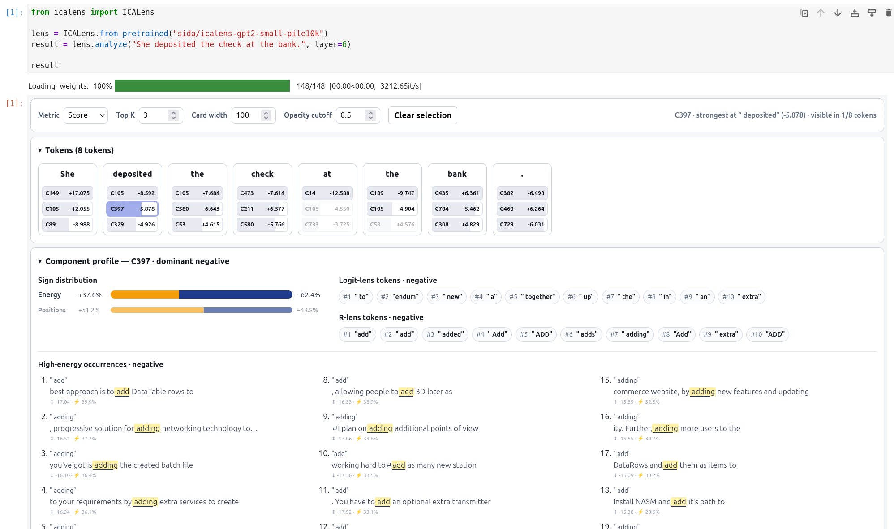

# Component profiles

An ICA direction is a coordinate, not a built-in semantic label. A component
profile attaches evidence that helps a researcher form and test a label.

Profiles complement the token cards in an analysis:

- the token cards show how a component behaves on the **current input**;
- the component profile summarizes how it behaved across a **profiling corpus**.

## How profiles are prepared

After fitting, ICA Lens streams a representative text or conversation dataset
through every fitted layer. It does not refit or change the ICA directions.
For each component, profiling records:

- score skewness, excess kurtosis, and the tail selected by skewness;
- how often its score is positive or negative;
- how its squared score energy is divided between the two signs;
- representative high-energy token occurrences and their surrounding text;
- vocabulary tokens associated with each writing direction through a logit-lens
  projection; and
- when a compatible R-lens has been added, vocabulary tokens associated after
  transporting the writing direction through the remaining model.

Profiles are saved inside the ICA Lens artifact under `component_profiles/`.
The profiling dataset and exact revision are recorded separately from fitting
provenance. See [Fit and publish](fit-and-publish.md#2-profile-every-fitted-layer)
for the CLI and Python workflows.

## Read a profile

Select a component in the token cards, then expand **Component profile**.

### Tail selection

ICA Lens uses the sign of skewness to select which tail to show: positive
skewness selects the positive tail, and negative skewness selects the negative
tail. Exact zero falls back to the side with greater squared-score energy. The
selection is stored as `tail_direction` (and as `dominant_sign` for
compatibility).

### Statistics

For component scores \(x_1,\ldots,x_N\), let \(\mu\) be their population mean
and \(\sigma\) their population standard deviation. The statistics shown in
the profile are:

- **Skewness** measures left-right asymmetry. Its sign indicates the more
  pronounced tail and therefore determines the selected sign:

  $$
  \operatorname{skewness}(x)
  = \frac{1}{N}\sum_{i=1}^{N}\left(\frac{x_i-\mu}{\sigma}\right)^3.
  $$

- **Excess kurtosis** measures how strongly the distribution produces extreme
  scores, without distinguishing positive from negative. A Gaussian
  distribution has excess kurtosis zero:

  $$
  \operatorname{excess\ kurtosis}(x)
  = \frac{1}{N}\sum_{i=1}^{N}\left(\frac{x_i-\mu}{\sigma}\right)^4-3.
  $$

- **Logcosh deviation** is the non-Gaussianity measure used when FastICA orders
  the component IDs. For \(M\) fitted ICA coordinates \(y_1,\ldots,y_M\), it is

  $$
  \left|
  \frac{1}{M}\sum_{i=1}^{M}\log\!\cosh(y_i)
  - \mathbb{E}_{Z\sim\mathcal{N}(0,1)}[\log\!\cosh(Z)]
  \right|.
  $$

  The standard-normal baseline is approximately \(0.374567\). Larger
  deviations are ordered first. Because this contrast is different from
  excess kurtosis, their ranks need not match.

Skewness and excess kurtosis are computed from the profiling scores; logcosh
deviation was computed from the fitting data. Full sign frequencies and
squared-energy fractions remain available in the profile data.

### Logit-lens tokens

These tokens are promoted when the component's writing direction is passed
through the model's final normalization and unembedding. They provide a second,
model-based clue that can support or challenge an interpretation suggested by
the corpus examples.

At an intermediate layer, this projection skips all remaining transformer
blocks. It is therefore a diagnostic association—not a prediction of what the
model will generate and not proof that the component means a listed token.

### R-lens tokens

R-lens tokens use a corpus-averaged linear map to transport the component's
writing direction toward a later residual-stream layer before applying the
model's final normalization and unembedding. Unlike the direct Logit Lens,
this readout incorporates an approximation of the intervening transformer
blocks.

They are still diagnostic associations: the map is averaged over a fitting
corpus and is not an exact input-specific causal effect. This row appears only
when the artifact has been enriched with a compatible R-lens.

### High-energy occurrences

These are corpus positions where the selected component accounts for a large
share of that token's score energy. The highlighted token is the selected
position; the lighter text provides its context.

Read several occurrences together. Repeated words, topics, syntactic roles, or
discourse patterns can suggest a working label. The list contains selected
high-energy examples, not every activation of the component and not a frequency
table for the whole dataset.

## Form a working label

A useful reading sequence is:

1. Start with the selected tail and high-energy occurrences.
2. Look for a pattern that repeats across different contexts.
3. Compare the Logit Lens and, when available, R-lens tokens with that
   interpretation.
4. Test the proposed label on new inputs with `lens.analyze()`.

Treat the result as a working hypothesis. Profiles make labeling much faster,
but their evidence depends on the profiling corpus and does not replace
validation on independent examples.
