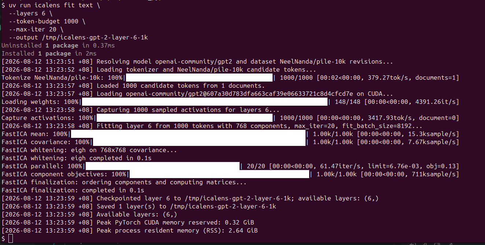

# Fit and publish

Producing a complete ICA Lens follows one workflow:

**Fit → Profile every fitted layer → Publish**

| Stage | Result |
| --- | --- |
| **Fit** | Component directions and fitted transforms for the requested layers |
| **Profile** | Sign statistics, representative occurrences, Logit Lens tokens, and compatible R-lens readouts |
| **Publish** | One self-contained ICA Lens artifact in a Hugging Face Model repository |

ICA Lens provides installed commands for all three stages. They are available
after:

```bash
pip install icalens
```

A CUDA GPU is currently required by the end-to-end fitting commands.

## 1. Fit component directions

### Quick text fit

Start with a small run that checks the complete fitting pipeline:

```bash
icalens fit text \
  --model openai-community/gpt2 \
  --dataset NeelNanda/pile-10k \
  --split train \
  --text-field text \
  --layers 6 \
  --token-budget 1000 \
  --max-iter 20 \
  --output icalens-output/quick-test
```

{ loading=lazy }

*A complete one-layer fitting run using the installed `icalens` command. This
run finished in about 10 seconds; runtime depends on the hardware and whether
the model and dataset are already cached.*

In this concrete setting:

- `--model openai-community/gpt2` selects the GPT-2 Small checkpoint. Its
  hidden width is 768, so a full-width lens contains 768 ICA components.
- `--dataset NeelNanda/pile-10k --split train --text-field text` reads raw text
  from the `text` column of the dataset's training split.
- `--layers 6` captures the residual stream after transformer block 6 only.
- `--token-budget 1000` fits from 1,000 token activations. This is deliberately
  small, but it exceeds the 769-token minimum required to fit 768 components
  after centering.
- `--max-iter 20` runs 20 fixed FastICA updates. At this small token budget,
  the complete example took about 10 seconds on the machine shown above.
- `--output icalens-output/quick-test` saves the manifest and fitted layer in
  that directory.

### Full text fit

For a substantive GPT-2 lens, increase the fitting budget and fit every layer:

```bash
icalens fit text \
  --model openai-community/gpt2 \
  --dataset NeelNanda/pile-10k \
  --split train \
  --text-field text \
  --layers all \
  --capture-layers-at-once 1 \
  --token-budget 1000000 \
  --max-iter 20 \
  --output icalens-output/icalens-gpt2-small
```

Both commands resolve and record the exact model and dataset revisions. They
tokenize the selected text field, capture post-block residual-stream
activations, fit the requested layers, and checkpoint each completed layer.

For raw text, `--document-framing auto` resolves the exact model in the
version-controlled `model_framing.json` registry. Known models receive their
document-boundary context token, which is excluded from fitting samples. If a
model is absent locally, ICALens checks and caches the current GitHub registry;
use `--refresh-model-registry` to request an update explicitly. Unknown models
fail safely unless `--document-framing` is set explicitly. The resolved policy,
registry hash, and evidence URL are saved in fitting provenance.

Use `--token-budget all` to fit from every usable token in the selected dataset.
The command reports the resolved token count after tokenization.

### Capture once and reuse activations

For large refits, capture all requested layers directly to an external disk first. The command
streams each document through the model once and appends `bfloat16` rows to per-layer files; it
does not retain all layers in CPU memory.

```bash
icalens capture text \
  --model openai-community/gpt2 \
  --dataset NeelNanda/pile-10k \
  --layers all \
  --candidate-tokens 1000000 \
  --token-budget 1000000 \
  --capture-layers-at-once all \
  --output /mnt/external/icalens-activations/gpt2-pile10k-1m
```

Then fit any preprocessing variant without another language-model forward pass:

```bash
icalens fit activations \
  --input /mnt/external/icalens-activations/gpt2-pile10k-1m \
  --layers all \
  --icalens-preprocessing none \
  --max-iter 20 \
  --fit-batch-size 8192 \
  --output local-icalens-models/refit-raw/icalens-gpt2-small-pile10k
```

Capture is resumable by layer. Re-run the same command after an interruption; completed layer
files are retained and only missing layers are captured. `fit activations` memory-maps one layer
at a time, while FastICA transfers bounded batches to CUDA.

The same files are available to other Python analyses without loading the full dataset:

```python
from icalens import ActivationDataset

captured = ActivationDataset("/mnt/external/icalens-activations/gpt2-pile10k-1m")
layer_6 = captured.layer(6)  # disk-backed [tokens, hidden_size] tensor
```

#### Example runtime for a larger model

As a concrete reference, one complete `Qwen/Qwen3.5-9B-Base` run used a single
NVIDIA GB10 system with 128 GB unified memory. PyTorch fitting ran on CUDA, and
the 32 layers of `bfloat16` activations were streamed to an external SSD. The
run used 1 million Pile-10k token activations, 4,096 components per layer, 50
FastICA iterations, and `--fit-batch-size 16384`:

| Stage | Calculation | Subtotal |
| --- | ---: | ---: |
| Tokenization, revision resolution, and model loading | 1 run × 47s | 47s |
| Capture activations directly to disk | 1M tokens across 32 layers | 50m 57s |
| Fit the captured activations | 32 layers × 50 iterations; 12m 44s/layer ≈ 15s/iteration | 6h 47m 40s |
| **Complete capture-and-fit run** | **including stage transitions** | **7h 39m 40s** |

Thus, the apparently long 6h 47m total is 32 sequential layer fits: each layer
took 12m 44s for 50 iterations, or about 15s per iteration when the full
per-layer fitting time is averaged across them. Covariance computation took
1m 25s per layer and whitening itself took 2s; excluding that setup, each
FastICA update took about 14s. These numbers are
illustrative rather than a hardware or storage-speed guarantee, but they give
the expected scale of a full-width, full-layer 9B run. Capturing once is
especially useful when several fitting variants will reuse the same activations.

### Fit from conversations

Fit an instruction-tuned Qwen3.5 lens from UltraChat conversations:

```bash
icalens fit chat \
  --model Qwen/Qwen3.5-2B \
  --dataset HuggingFaceH4/ultrachat_200k \
  --split train_sft \
  --layers all \
  --capture-layers-at-once 1 \
  --token-scope all \
  --token-budget 1000000 \
  --max-iter 20 \
  --output icalens-output/icalens-qwen3.5-2b-ultrachat-1m
```

Conversations are rendered with the model tokenizer's chat template before
activation capture. The dataset must provide a message list with `role` and
`content` fields; select another column with `--messages-field`.

`--token-scope all` makes every rendered position eligible for fitting,
including role markers and template tokens. The other scopes are `content`,
`user`, and `assistant`. A narrower scope changes which activation rows are
sampled, while the complete rendered conversation remains the model context.

### Fitting controls

| Option | Purpose |
| --- | --- |
| `--model` | Hugging Face language-model repository |
| `--dataset` | Hugging Face fitting-dataset repository |
| `--split` | Dataset split to stream |
| `--text-field` | Raw-text column used by `icalens fit text` |
| `--context-length` | Maximum number of tokens retained from each text document |
| `--document-framing` | Exact-model registry policy (`auto`), or an explicit `none`, `prepend-bos`, or `prepend-eos` |
| `--refresh-model-registry` | Fetch and cache the current framing registry from GitHub |
| `--layers` | Comma-separated zero-based transformer-block indices, or `all` |
| `--token-budget` | Number of sampled activation rows used for fitting |
| `--candidate-tokens` | Size of the token pool sampled from, or `all` for the entire dataset; defaults to the token budget |
| `--capture-layers-at-once` | Number of layers materialized in CPU memory together; `0` means all requested layers |
| `--fit-batch-size` | Activation rows processed on the GPU at once; `0` materializes all fitting rows |
| `--max-iter` | Fixed number of FastICA iterations |
| `--objective-every` | Record objective percentiles every N iterations |
| `--seed` | Token-sampling and FastICA initialization seed |
| `--max-vram-gb` | Optional PyTorch CUDA allocator limit for testing a memory budget |

FastICA uses the requested fixed iteration count; it does not stop early using
a tolerance criterion. Full-width ICA also requires at least
`hidden_size + 1` sampled activations because centering removes one degree of
rank.

### Memory behavior

Captured activations are held in CPU memory, while fitting processes bounded
batches on the GPU. The two main controls address different resources:

- Lower `--capture-layers-at-once` to reduce CPU activation memory. A value of
  `1` captures and fits one layer before moving to the next.
- Lower `--fit-batch-size` to reduce fitting-time GPU memory.

The model forward pass stops after the deepest layer needed by the current
capture group. Each fitted layer is saved immediately, including its objective
history, so earlier layers remain usable if a later layer is interrupted.

### Fit existing activations

Use the Python API when you already have an activation tensor. Its final
dimension must equal the model hidden size; leading dimensions are treated as
sample dimensions. This complete example uses synthetic GPT-2-width
activations so it can run as written; replace them with activations captured
from your data to produce a meaningful lens.

```python
import torch

from icalens import ICALens

# A full-width 768-component fit needs at least 769 samples after centering.
generator = torch.Generator().manual_seed(0)
activations = torch.randn(1000, 768, generator=generator)

lens = ICALens(
    model_id="openai-community/gpt2",
    model_type="base",
    activation_site="resid_post",
)

lens.fit(
    activations,
    layer=6,
    max_iter=20,
    batch_size=8192,
    device="cuda",
    progress=True,
    provenance={
        "dataset": {"description": "synthetic API example"},
        "fitting_tokens": int(activations.shape[0]),
    },
)

output = lens.save("icalens-output/my-icalens")
print(f"Saved layer {lens.available_layers} to {output}")
```

Calling `fit()` again adds or replaces a layer in the same lens. Pass
`n_components` to fit fewer components than the hidden size.

## 2. Profile every fitted layer

Fitting determines the directions; profiling gives each direction the evidence
needed for interpretation. Profile every fitted layer against a representative
corpus before publishing. Profiling does not rerun FastICA or change the fitted
center or matrices. For every component, it records:

- positive and negative token-position frequencies;
- the fraction of squared score energy on each sign and the resulting dominant sign;
- high-energy token occurrences, token counts, scores, positions, and short contexts; and
- top and bottom vocabulary tokens obtained by passing both writing-vector directions
  through the model's final norm and unembedding.

The standard CLI workflow streams the profiling dataset from Hugging Face and
updates the existing Lens directory in place:

```bash
icalens profile \
  --lens icalens-output/icalens-qwen3.5-2b-ultrachat-1m \
  --layers all \
  --dataset HuggingFaceH4/ultrachat_200k \
  --split train_sft \
  --token-scope all \
  --max-tokens 100000 \
  --top-k-examples 20 \
  --min-energy 0.05
```

`--max-tokens` is the profiling budget for each layer. Every completed profile
is checkpointed immediately under the Lens's `component_profiles/` directory,
so no second output path is needed and completed layers survive an interruption.
The profiling dataset and its exact revision are recorded separately from the
fitting provenance.

### Profile a Lens fitted from your own activations

If you prepare the fitting activations yourself, retain a replayable stream of
the source texts or completed conversations. An anonymous activation tensor is
enough to fit directions, but it cannot provide token occurrences or context.
The profiling corpus need not contain the exact fitting tokens, but it should
represent the same domain. To profile the fitting distribution itself, retain
the original records together with the token scope, context length, sampling
seed, sampling policy, and dataset revision used during capture.

The Python method that creates a profile is `profile_components()` (plural).
It accepts raw text for a base model or message lists for an instruct model:

```python
from icalens import ICALens

lens_path = "icalens-output/my-icalens"
lens = ICALens.from_pretrained(lens_path)

# Replayable source inputs retained alongside the fitting activations.
profiling_inputs = ["First document...", "Second document..."]

for layer in lens.available_layers:
    lens.profile_components(
        profiling_inputs,
        layer=layer,
        max_tokens=100000,
        top_k_examples=20,
        min_energy=0.05,
        device="auto",
        progress=True,
    )

lens.save(lens_path)
```

For an instruct model, each item in `profiling_inputs` is a completed
conversation such as:

```python
[
    {"role": "user", "content": "Explain the result."},
    {"role": "assistant", "content": "The result shows..."},
]
```

Keep raw source records rather than decoded tokens when possible. ICA Lens
applies the recorded tokenizer and, for conversations, the model's chat
template. Call `save()` after the profiles have been attached to the Lens.

### Inspect a stored profile

The separate `component_profile()` method **reads** one stored component
profile:

```python
profile = lens.component_profile(layer=5, component=188)
print(profile["dominant_sign"])
print(profile["examples"]["negative"]["tokens"])
print(profile["logit_lens"]["dominant"]["top_tokens"])
```

The logit-lens entries are diagnostic associations: at an intermediate layer,
they skip the remaining transformer blocks and therefore are not exact causal
predictions of generated tokens.

### Add R-lens readouts

If a compatible fitted R-lens is available, add its vocabulary readouts to the
existing component profiles without replaying the profiling dataset:

```bash
icalens profile add-r-lens \
  --lens icalens-output/my-icalens \
  --layers all \
  --r-lens local-r-lens-models/model/lens.pt
```

This additive command preserves the sign statistics, high-energy occurrences,
Logit Lens entries, and ICA matrices already stored in the artifact. It updates
the same `component_profiles/` files in place, so no output path or dataset is
required. By default it retains 20 R-lens tokens per direction and processes 8
directions at once; use `--r-lens-top-k` and `--r-lens-batch-size` to change
those values.

The R-lens must match the analyzed model and hidden size and must contain a
source-layer map for each requested `resid_post` layer. R-lens tokens account
for an average linear approximation of the remaining transformer blocks, but
they remain diagnostic associations rather than exact input-specific effects.

To reuse a base model's R-lens for its architecture-compatible instruction-tuned
checkpoint, opt in explicitly:

```bash
icalens profile add-r-lens \
  --lens icalens-output/my-instruct-icalens \
  --layers all \
  --r-lens local-r-lens-models/base-model/lens.pt \
  --allow-base-model-transfer
```

This saves R-lens fitting compute while retaining the instruction model's own
final normalization and unembedding. ICALens still checks the hidden size,
activation site, and source-layer maps, and records both source and target model
identities in the artifact. Because instruction tuning changes the intervening
weights, transferred readouts should be treated as an approximation.

### Complete artifact contents

After fitting and profiling, the artifact contains:

- analyzed model ID, type, and exact revision;
- activation site and layer-index convention;
- L2 preprocessing and fitted center;
- reading and writing matrices;
- FastICA configuration, objective history, and component ordering;
- component sign statistics, representative high-energy occurrences, and
  Logit Lens tokens for every profiled layer;
- R-lens tokens and their provenance for layers enriched with a compatible
  R-lens;
- available layers and component counts; and
- separate fitting and profiling provenance.

The artifact does not contain the analyzed language-model weights.

## 3. Publish

ICA Lens artifacts belong in a Hugging Face **Model** repository.

### Authenticate with Hugging Face

Authenticate with a write-enabled token using the standard Hugging Face CLI:

```bash
hf auth login
```

Alternatively, set `HF_TOKEN` in the environment. The publishing command also
reads `HF_TOKEN` from `.env` in the current directory:

```dotenv
HF_TOKEN=hf_...
```

Do not commit this file or token.

### Upload and verify

Publish a saved artifact:

```bash
icalens publish \
  --lens icalens-output/icalens-qwen3.5-2b-ultrachat-1m \
  username/icalens-qwen3.5-2b-ultrachat-1m
```

Add `--private` to create a private repository. The command uploads the
artifact, downloads its manifest again, and verifies that the remote metadata
and available layers match the local lens.

The Python equivalent is:

```python
lens.push_to_hub("username/icalens-qwen3.5-2b-ultrachat-1m")
```

After publication, load it from any environment with:

```python
from icalens import ICALens

lens = ICALens.from_pretrained("username/icalens-qwen3.5-2b-ultrachat-1m")
```
