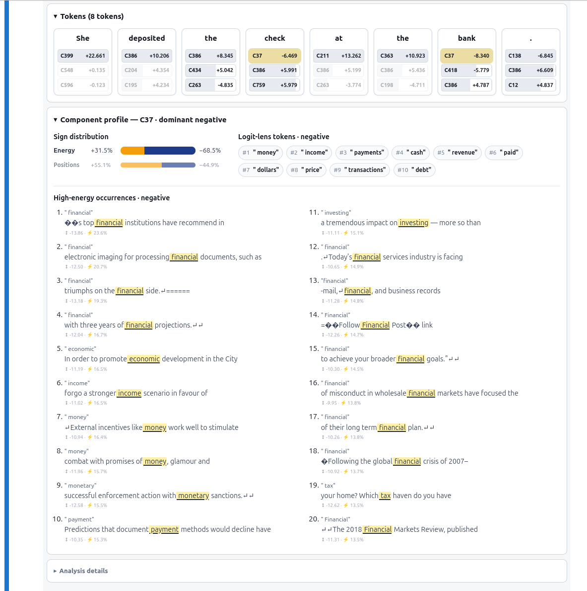
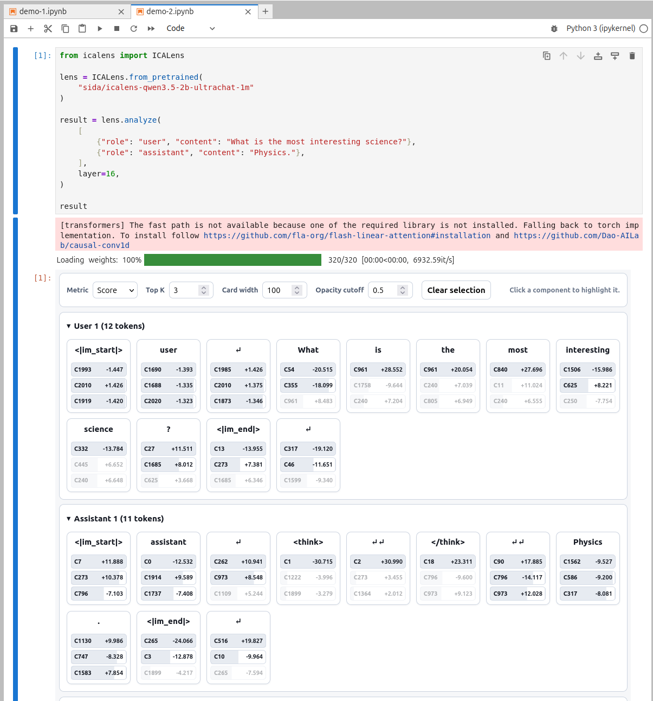

# Getting started

This page takes you from installation to an interactive analysis of text or a
conversation.

## Install

ICA Lens requires Python 3.10 or newer. A CUDA GPU is recommended for loading
and running the analyzed language model; CPU execution is supported but slower.

```bash
pip install icalens
```

You can access public models on Hugging Face without signing in. Authentication
is required for private or gated repositories and also provides higher download
rate limits.

## Analyze text

```python
from icalens import ICALens

lens = ICALens.from_pretrained("sida/icalens-gpt2-small-pile10k")
result = lens.analyze("She deposited the check at the bank.", layer=6)

result
```

In Jupyter or Colab, the final `result` expression displays an interactive
token-level analysis. The first analysis loads the language model and the
requested lens layer. Later analyses with the same `lens` reuse the model in
memory.

The default `device="auto"` uses CUDA when available and otherwise uses the
CPU. You can override it with `device="cuda"` or `device="cpu"`.

## Read the result

In Jupyter or Colab, the result is displayed as an interactive token-level
analysis.

{ loading=lazy }

- Each card represents one token at the selected model layer.
- `C37`, for example, identifies ICA component 37.
- **Score** shows the signed component activation and preserves direction.
- **Energy** shows the component's share of squared score magnitude for that
  token.
- Select a component to highlight it across all displayed tokens.

### Read a component profile

When a selected component has a profile, expand **Component profile** below the
token cards.

{ loading=lazy }

- **Sign distribution** shows whether the component's energy usually appears
  on its positive or negative side. Read the two sides as distinct directions.
- **High-energy occurrences** shows representative places where that side was
  especially strong. Read the highlighted token together with its surrounding
  text to infer a possible meaning.
- **Logit-lens tokens** shows vocabulary tokens promoted by the component's
  writing direction. Treat these as supporting clues, not as a definitive
  label or a prediction of generated text.
- **R-lens tokens**, when present, include an average linear approximation of
  the remaining transformer blocks and provide a complementary readout.

The controls above the token cards change the metric and the number of
components shown. Start with the occurrences, check whether their contexts are
consistent, and then compare the Logit Lens and R-lens tokens as additional
evidence.

## Analyze another input

Reuse the same lens to compare components across inputs without loading the
language model again:

```python
result = lens.analyze("She walked along the river bank.", layer=6)
result
```

Call `lens.unload_model()` when you want to release the cached model and
tokenizer from memory.

## Analyze a conversation

Instruction-tuned lenses accept messages with `role` and `content` fields:

```python
from icalens import ICALens

lens = ICALens.from_pretrained(
    "sida/icalens-qwen3.5-2b-ultrachat-1m"
)

result = lens.analyze(
    [
        {"role": "user", "content": "What is the most interesting science?"},
        {"role": "assistant", "content": "Physics."},
    ],
    layer=16,
)

result
```

{ loading=lazy }

The tokenizer's chat template is applied automatically. By default, the
analysis includes content, role markers, separators, and other template tokens.
`analyze()` analyzes the supplied conversation; it does not generate a new
assistant response.

## Save an ICA Lens Explorer

Save the result as a self-contained ICA Lens Explorer for use outside a
notebook:

```python
result.to_html("analysis.html")
```

## Next steps

- Learn about [text and chat inputs](text-and-chat.md).
- Understand [scores and energy](scores-and-energy.md).
- Map component scores back through [reconstruction](reconstruction.md).
- [Fit and publish](fit-and-publish.md) your own ICA lens.
