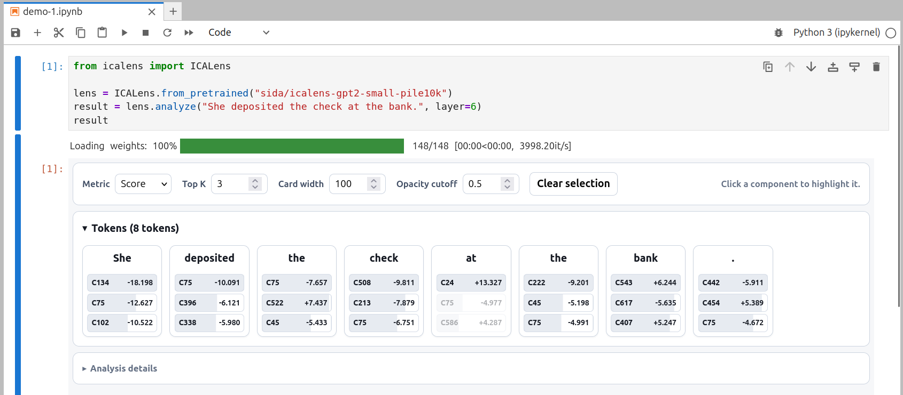

# ICA Lens

ICA Lens maps language-model activations into independent components with a
lightweight fitting process that is substantially more compute-efficient than
training an SAE dictionary. It provides a compact Python API for loading,
fitting, sharing, and applying ICA transformations to base and instruction-
tuned language models.

```bash
pip install icalens
```

```python
from icalens import ICALens

lens = ICALens.from_pretrained("sida/icalens-gpt2-small-pile10k")
result = lens.analyze("She deposited the check at the bank.", layer=6)

result
```

Browse the [ICA Lens model collection](https://huggingface.co/collections/sida/ica-lens)
for other published lenses.



*Interactive token-level component analysis in Jupyter.*

In Jupyter or Colab, `result` displays the interactive explorer inline. Use
`result.to_html("analysis.html")` to save it as a standalone file.

[Get started](getting-started.md){ .md-button .md-button--primary }
[Read the paper](https://arxiv.org/abs/2606.11722){ .md-button }

## What ICA Lens provides

- Fit ICA lenses on activations from base or instruction-tuned language models.
- Analyze raw text and multi-turn conversations at any fitted layer.
- Inspect signed component scores and per-token energy shares interactively.
- Label components using high-energy examples, Logit Lens tokens, and optional
  R-lens readouts.
- Save, load, and share lenses through local folders or Hugging Face Hub.
- Scale fitting to large token collections with bounded GPU and CPU memory.

## Authors

- [Sida Liu](https://liusida.com/)
- [Feijiang Han](https://feijianghan.com/)

## Citation

```bibtex
@article{liu2026icalens,
  title={ICA Lens: Interpreting Language Models Without Training Another Dictionary},
  author={Liu, Sida and Han, Feijiang},
  journal={arXiv preprint arXiv:2606.11722},
  year={2026}
}
```
