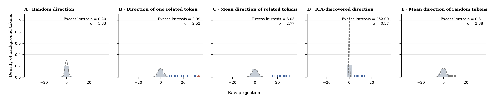

# A Toy Example · What Makes a Non-Gaussian Projection Interesting?



We use individual tokens at Layer 0 of GPT-2 (the output of the first
transformer block) for this toy example because their representations are
relatively easy to inspect. Specifically, we collect the Layer-0 activations of
all 50,256 non-special GPT-2 tokens and fit ICA to these vectors.

We select an ICA component with relatively high excess kurtosis and inspect the
20 tokens with the largest projection magnitudes. We orient the component so
that this tail is positive and refer to these as the **related tokens** (`␣`
denotes a leading space):

<table>
<tr><td>Neither</td><td>␣neither</td><td>␣Neither</td><td>␣either</td><td>␣Either</td><td>␣Both</td><td>Both</td><td>Either</td><td>␣both</td><td>either</td></tr>
<tr><td>both</td><td>OTH</td><td>ither</td><td>between</td><td>␣Between</td><td>␣between</td><td>Between</td><td>ween</td><td>␣latter</td><td>␣respectively</td></tr>
</table>

The activation space is $\mathbb{R}^{768}$. We first center the data, placing
the background mean at the origin. We then choose five directions and project
the activations onto them.

The panels show raw projections. The gray histogram shows the background
tokens. The dashed normal curve is fitted using the mean and standard deviation
of all projection values. For every direction, both the reported $\sigma$ and
excess kurtosis are computed over all 50,256 tokens.

The figure compares five directions:

### A · Random direction

We sample a random direction.

In **A**, excess kurtosis is close to zero and the projected distribution is
approximately Gaussian. This is consistent with a generic dense direction
mixing many sources of variation, so no small group of tokens dominates the
tails.

### B · Direction of one related token

We use the activation direction of `either`, one of the related tokens.

In **B**, excess kurtosis increases and the projected distribution becomes
non-Gaussian. The selected token lies at the positive extreme, and several
related tokens also fall in the positive tail because their activation
directions are similar to the target token's direction. These large deviations
increase excess kurtosis because tail observations have disproportionate
influence on the fourth moment.

### C · Mean direction of related tokens

We use the direction of the mean activation of the 20 related tokens.

In **C**, the projected distribution is again moderately non-Gaussian.
Averaging the related-token activations places the same token family in the
positive tail, but the background still varies substantially along this
manually constructed direction. The related tokens are therefore less extreme
relative to the scale of the background.

### D · ICA-discovered direction

We use the direction recovered by the selected ICA component.

In **D**, excess kurtosis is very high and the projected distribution is
strongly non-Gaussian. The ICA-discovered direction retains large positive
projections for the related tokens while most background tokens project close
to zero. The distribution therefore has a narrow background and a sparse,
distant tail, making the related tokens much more extreme than in B or C.

Whitening provides the setting in which ICA finds this structure. It transforms
the data so that every direction has the same variance before ICA chooses a
rotation. ICA therefore cannot prefer a direction merely because of its overall
scale; it must prefer a direction whose standardized projection distribution is
more non-Gaussian.

The intuitive takeaway is that ICA can discover a direction onto which a small
family of representations projects strongly, while most background
representations project weakly—meaning that they are approximately orthogonal
to that direction after centering.

### E · Mean direction of random tokens

Finally, we use the direction of the mean activation of 20 randomly selected
tokens, serving as a control for C.

In **E**, excess kurtosis is close to zero and the projected distribution is
approximately Gaussian. This controls for the act of averaging 20 token
activations: unlike C, the mean of 20 random tokens does not select a coherent
group in the far tail.

## Conclusion

This toy example suggests that a non-Gaussian direction can be understood
through two complementary properties:

1. A small family of representations projects strongly, indicating that they
   are aligned with—and therefore related to—the representational pattern
   captured by the direction.
2. Most other representations are approximately orthogonal to the direction,
   indicating that they contain little of this particular pattern.

Together, these properties create a sparse tail against a concentrated
background, producing a strongly non-Gaussian distribution. We can understand
such a direction by inspecting the common pattern among the strongly projecting
representations and contrasting it with the weakly projecting background.

## Reproduction

From the repository root, run:

```bash
bash experiments/toy-example/scripts/run.sh
```

The script captures GPT-2 Layer-0 activations, fits the full-vocabulary ICA
model, selects the token family, and regenerates the figure and compact results.
Large activation and fitting artifacts are kept under the ignored `work/`
directory; only the final figure, results, documentation, and scripts are
released.
